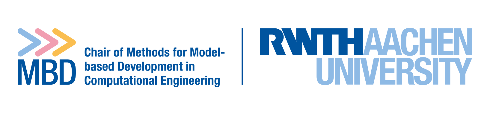

# Methods for Model-based Development in Computational Engineering

Our chair was founded by Professor Kowalski in August 2021. The group's research focuses on innovative methods for model-based development and decision support. This includes predictive process simulations as well as sustainable digital infrastructure and federated model and data architectures.

 [mbd.rwth-aachen.de](https://www.mbd.rwth-aachen.de/)

## Open source research software

### PSimPy

`PSimPy` (Predictive and probabilistic simulation with Python) implements a Gaussian process emulation-based framework that enables systematic and efficient investigation of uncertainties associated with physics-based models (i.e. simulators).

 [git.rwth-aachen.de/mbd/psimpy](https://git.rwth-aachen.de/mbd/psimpy)
 [mbd.pages.rwth-aachen.de/psimpy](https://mbd.pages.rwth-aachen.de/psimpy/)

### SHIRE

`SHIRE` (Susceptibility Hazard mappIng fRamEwork) is a tool to facilitate and streamline landslide susceptibility and hazard mapping using a Random Forest classifier. It provides support for repetitive steps in landslide susceptibility and hazard mapping such as input dataset generation including data pre-processing.
It is a Python-based modular framework that can be complemented with individual modules necessary for answering individual mapping challenges due to the open-access nature of the code.

 [git.rwth-aachen.de/mbd/shire](https://git.rwth-aachen.de/mbd/shire)
 [mbd.pages.rwth-aachen.de/shire](https://mbd.pages.rwth-aachen.de/shire/)
 [Edrich et al. (2024) in Springer:Natural Hazards](https://doi.org/10.1007/s11069-024-06563-8)

### pyresice

`pyresice` contains the software used to create the Reusability-targeted Enriched Sea Ice Core Database (RESICE) and can be used to extend or reproduce the database.

 [git.rwth-aachen.de/mbd/pyresice](https://git.rwth-aachen.de/mbd/pyresice)
 [Simson et al. (2025) in Nature:Scientific Data](https://doi.org/10.1038/s41597-025-04665-x)

## Courses

### CMM: Continuum Mechanical Modeling for Simulation Science

This lecture provides an introduction to continuum mechanical modeling from the perspective of simulation science and computational engineering. Offered since 2024, the lecture is a re-titled and re-designed version of the lecture ‘From Molecular to Continuum Physics II’, which was offered 2023 and 2022.

 [mbd.pages.rwth-aachen.de/courses/cmm](https://mbd.pages.rwth-aachen.de/courses/cmm)

### SCE: Sustainable Computational Engineering

Sustainable Computational Engineering introduces into the elements of data life cycle and model development cycle to students interested in data-integrated and potentially high-throughput modelling tasks. The complementary exercise intensifies content of the lecture with theoretical and application-oriented examples.
The lecture is offered since 2022.

 [mbd.pages.rwth-aachen.de/courses/sce](https://mbd.pages.rwth-aachen.de/courses/sce/)

### QCE: Quantum Computational for Engineering

Quantum computers are an emerging future technology that have the potential to fundamentally change the way we process data and solve problems using computational methods. This course aims to prepare students from engineering fields by providing an introduction to the world of quantum computing. Practical examples complement the lecture and will be used to illustrate the possibilities of using quantum computers today. Students will gain knowledge about the current state of development and possible future fields of quantum computing for engineers. The lecture is offered since 2024.

 [mbd.pages.rwth-aachen.de/courses/sce](https://mbd.pages.rwth-aachen.de/courses/qce/)
